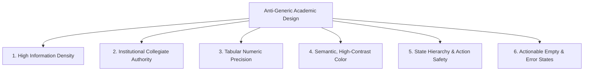

# Anti-Generic Design Philosophy & Standards

> **Project:** Golden West Colleges, Inc. (GWC) Grading & Academic Evaluation System  
> **Target Audience:** College Deans, Faculty Members, Registrars, and Students  
> **Core Objective:** Deliver an authentic, high-density, authoritative academic tool that rejects generic SaaS clichés and unstyled AI-template aesthetics.

---

## 1. The Anti-Generic Manifesto

### Why Generic Templates Fail Academic & Enterprise Software
Modern web design is flooded with interchangeable AI-generated templates and default UI kits. While these might look flashy on a landing page mockup, they are catastrophic failures in serious data-driven institutional applications:

* **The "Floating Purple/Pink Gradient" Trap:** Abstract pastel gradients evoke marketing landing pages, not the credibility and authority of an accredited academic institution.
* **Bloated Artificial Whitespace:** 48px to 64px padding between table cells forces an instructor grading 50 students to scroll through 10 screens just to view one midterm column.
* **Unreadable Low-Contrast Gray Text:** Styling secondary labels with `#94a3b8` or `#cbd5e1` on white backgrounds violates WCAG standards and causes severe eye strain during extended grading sessions.
* **Proportional Number Jitter:** Numbers rendered with standard proportional fonts cause decimal points and digits to wobble vertically (`1` is narrower than `8`), making row scanning and average verification mentally taxing.
* **Vague Empty States:** Cute cartoon illustrations saying *"Oops, nothing here!"* provide zero administrative utility. Instructors and deans need actionable instructions.

---

## 2. The 6 Pillars of Anti-Generic Academic Design



### Pillar 1: High Information Density (Utility First)
* Academic staff manage dozens of courses and hundreds of student records. Prioritize **compact, legible data presentation** over decorative breathing room.
* Use compact table cells (`padding: 6px 12px;`) with clear row dividers.
* Employ **sticky table headers** (`position: sticky; top: 0; z-index: 10;`) so column labels (Student ID, Name, Prelim, Midterm, Semi, Final, Remarks) remain visible regardless of roster length.
* Keep primary grade input fields focused and compact (`width: 76px; height: 32px; font-size: 13px;`).

### Pillar 2: Institutional Collegiate Authority
* Use an authentic collegiate palette anchored in **GWC Deep Navy (`#1e3a8a`)**, crisp neutral borders (`#cbd5e1`), and clean surface slates (`#f8fafc`).
* Reject soft 24px drop shadows and floating rounded pills for data grids. Use structured, grounded containers with subtle 1px borders (`border: 1px solid #e2e8f0; border-radius: 6px;`).
* Embrace an editorial, authoritative typography system: clean sans-serif system fonts (`-apple-system, BlinkMacSystemFont, 'Segoe UI', Roboto`) for maximum rendering speed and zero layout shifts.

### Pillar 3: Tabular Numeric Precision (`tabular-nums`)
* In an academic grading sheet, numbers represent critical evaluations: GPAs (`1.25`, `2.75`), raw scores (`88.50`), and units (`3.0`).
* Every grade input, calculated average, and summary metric **MUST enforce `font-variant-numeric: tabular-nums`**.
* This ensures all numerals share identical glyph widths so decimal points align vertically like a financial ledger:
  ```text
  INCORRECT (Proportional Jitter):   CORRECT (Tabular Aligned):
  [ 88.50 ]                          [  88.50 ]
  [ 100.00 ]                         [ 100.00 ]
  [ 74.25 ]                          [  74.25 ]
  [ 9.00 ]                           [   9.00 ]
  ```

### Pillar 4: Semantic, High-Contrast Color System
* Color in this system is functional, not decorative. Each tone conveys academic status:
  * **Institutional Primary (`#1e3a8a` / `#1d4ed8`):** Navigation, primary brand anchors, section dividers.
  * **Academic Passing / Honors (`#16a34a` / `#15803d`):** Grades $\ge 75\%$, Dean's List badges, approved submissions.
  * **Academic Review / Warning (`#d97706` / `#b45309`):** Pending reviews, draft modifications, irregular student warnings.
  * **Academic Deficiency / Danger (`#dc2626` / `#b91c1c`):** Failing marks ($< 75\%$), returned grade sheets, validation errors.
  * **Neutral Metadata (`#334155` / `#475569`):** Course codes, student IDs, timestamps.
* **Accessibility Rule:** Never use color alone to convey status. Every colored badge must pair with a clear textual label and an icon (e.g., `<i class="bi bi-check-circle-fill"></i> Approved`).

### Pillar 5: State Hierarchy & Action Safety
* Distinguish between **transient working actions** and **permanent administrative commitments**:
  * **"Save Draft" (Secondary Action):** Rendered in neutral/outline style (`btn btn-outline-secondary`). Can be clicked repeatedly with zero irreversible consequences.
  * **"Submit for Review" (Primary Commitment):** Distinct institutional blue (`btn btn-primary`). Triggers a modal confirmation explaining that student inputs will be locked for Dean review.
  * **"Approve Sheet" (Dean Authority):** Distinct academic success style (`btn btn-success`) with an explicit confirmation dialog.
  * **"Return Sheet" (Dean Rejection):** Warning/danger style with a mandatory feedback comment box explaining required corrections.

### Pillar 6: Actionable Empty & Error States
* Never leave a table or container blank. When data is absent, explain **why** and provide the **direct solution**:
  * *Generic/Bad:* "No data found."
  * *Anti-Generic/Good:* "No faculty members have been assigned to this course yet for 1st Semester 2026–2027. **[Assign Faculty Member]**"
* Form errors must point directly to the invalid row or field with human-readable guidance (e.g., *"Row 14 (Mark Reyes): Score must be between 0.00 and 100.00"*).

---

## 3. "Do This vs. Never Do That" Standards

| Element |  Anti-Generic Standard (Do This) |  Generic Cliché (Never Do That) |
| :--- | :--- | :--- |
| **Color Palette** | Deep Navy (`#1e3a8a`), slate grays, semantic green/red. High WCAG AA contrast. | Pastel neon gradients, purple-to-pink blends, low-contrast `#a0aec0` text. |
| **Grid Spacing** | Dense, compact table cells (`py-2 px-3`), maximize records visible per viewport. | Over-padded cards (`p-5`), huge 80px row gaps requiring excessive scrolling. |
| **Corner Radii** | Sharp, disciplined 4px–6px radius. Institutional and structured. | Extreme 24px–50px pill shapes on administrative tables and forms. |
| **Number Formatting** | Monospaced numeric figures (`tabular-nums`), decimal points vertically aligned. | Proportional fonts where numbers wiggle and misalign across columns. |
| **Typography & Weight**| Native system fonts (`-apple-system`, `Segoe UI`). **Max font-weight capped at 600**. | Heavy weights (`700`, `800`, `900`, `bold`), slow web fonts, display serifs. |
| **Sidebar Navigation** | Slate background (`#e2e8f0`) with dark navy icon for active items. | Generic left accent border bars (`border-left: 3px solid ...`), solid dark navy blocks. |
| **Buttons & Actions** | Clear visual hierarchy: Primary, Secondary Outline, Destructive with confirmation. | Uniform blue pills everywhere with vague labels like "Submit" or "Do It". |
| **Table Headers** | Sticky headers with dark background/contrast border so labels never disappear. | Disappearing headers when scrolling past 10 students. |
| **Empty States** | Contextual explanations with direct action buttons (e.g., "Add First Subject"). | Cartoon illustrations of sleeping robots or empty shopping carts. |
| **Notifications** | Direct, dismissible alert banners explaining exact cause and remediation steps. | Vague floating toasts saying *"Something went wrong"* with no context. |

---

## 4. Reusable Anti-Generic CSS Classes

The following classes are implemented in [public/assets/css/app.css](file:///C:/xampp/htdocs/grading-system/public/assets/css/app.css) and [public/assets/css/pages/grading.css](file:///C:/xampp/htdocs/grading-system/public/assets/css/pages/grading.css):

```css
/* Tabular Numerics for All Academic Calculation Data */
.tabular-nums,
.table-academic td,
.table-academic th,
.grade-input {
    font-variant-numeric: tabular-nums;
    font-feature-settings: "tnum" 1;
}

/* High-Density Academic Data Table */
.table-academic {
    border-collapse: separate;
    border-spacing: 0;
    width: 100%;
    font-size: 0.85rem;
}

.table-academic th {
    background-color: #1e3a8a;
    color: #ffffff;
    font-weight: 600;
    text-transform: uppercase;
    letter-spacing: 0.03em;
    padding: 8px 12px;
    position: sticky;
    top: 0;
    z-index: 10;
}

.table-academic td {
    padding: 6px 12px;
    border-bottom: 1px solid #e2e8f0;
    vertical-align: middle;
}

.table-academic tbody tr:hover {
    background-color: #f1f5f9;
}

/* Precision Grade Entry Field */
.grade-input {
    width: 80px;
    height: 32px;
    padding: 4px 8px;
    text-align: right;
    font-weight: 600;
    border: 1px solid #cbd5e1;
    border-radius: 4px;
    transition: border-color 0.15s ease-in-out, box-shadow 0.15s ease-in-out;
}

.grade-input:focus {
    border-color: #2563eb;
    box-shadow: 0 0 0 2px rgba(37, 99, 235, 0.2);
    outline: none;
}

/* Academic Status Badges */
.badge-academic {
    display: inline-flex;
    align-items: center;
    gap: 4px;
    font-size: 0.75rem;
    font-weight: 600;
    padding: 3px 8px;
    border-radius: 4px;
    text-transform: uppercase;
    letter-spacing: 0.02em;
}

.badge-draft        { background-color: #f1f5f9; color: #475569; border: 1px solid #cbd5e1; }
.badge-submitted    { background-color: #e0f2fe; color: #0369a1; border: 1px solid #bae6fd; }
.badge-under-review { background-color: #ede9fe; color: #6d28d9; border: 1px solid #ddd6fe; }
.badge-approved     { background-color: #dcfce7; color: #15803d; border: 1px solid #86efac; }
.badge-returned     { background-color: #fee2e2; color: #b91c1c; border: 1px solid #fca5a5; }
.badge-finalized    { background-color: #f8fafc; color: #1e293b; border: 1px solid #94a3b8; }
```

---

## 5. Developer Verification Checklist

Before shipping any new view, layout, or table in the GWC Grading System, verify:

- [ ] **Tabular Numerics:** Are all score cells, GPAs, and student IDs styled with `tabular-nums`?
- [ ] **Font Weight Cap:** Is the maximum font weight capped at `600` (semibold) with zero `700`/`800`/`bold`?
- [ ] **Sidebar Navigation:** Are active sidebar links styled with a slate background (`#e2e8f0`) without generic left borders?
- [ ] **Density Check:** Can an instructor view at least 15–20 student rows on a 1080p screen without scrolling?
- [ ] **Contrast Compliance:** Does all body copy and secondary metadata have a contrast ratio of at least $4.5:1$ against its background?
- [ ] **Sticky Headers:** When scrolling through a 50-student section, do the column headers remain anchored at the top?
- [ ] **Modal Safeguards:** Are destructive or irreversible actions (Dean return with remarks, Sheet submission) protected by explicit confirmation modals?
- [ ] **Offline Independence:** Are all styles and icons served locally via `public/assets/vendor/` without external CDN dependencies?
