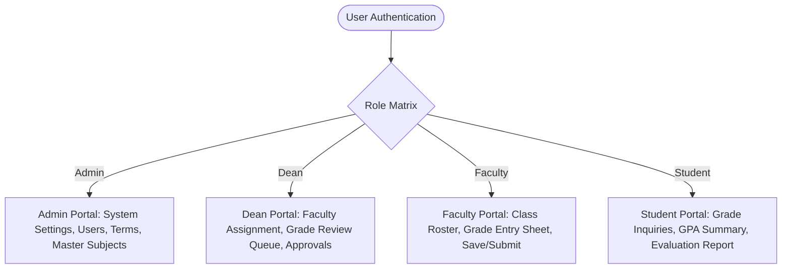

# GWC Acadtrack — Web Design & UI/UX Architecture Specification

> **Project:** Golden West Colleges, Inc. (GWC) Grading & Academic Evaluation System  
> **Tech Stack:** Vanilla PHP 8.2 MVC, MySQL 10.4+, Bootstrap 5.3.3, Bootstrap Icons 1.11.3, Vanilla JavaScript  
> **Related Documents:**
> * [Bootstrap 5 Component & Form Guidelines](file:///C:/xampp/htdocs/acadtrack/docs/BOOTSTRAP_GUIDE.md)
> * [Casing & Typography Guidelines](file:///C:/xampp/htdocs/acadtrack/CASING_GUIDELINES.md)
> * [Anti-Generic Design Standards](file:///C:/xampp/htdocs/acadtrack/docs/ANTI_GENERIC_DESIGN.md)
> * [System Architecture](file:///C:/xampp/htdocs/acadtrack/docs/ARCHITECTURE.md)

---

## 1. Design System Identity & Philosophy

The **GWC Acadtrack** is a mission-critical academic portal built for instructors, academic deans, administrators, and students. Unlike consumer-facing web applications or marketing landing pages, an academic grading portal requires:

1. **Institutional Authority:** Grounded in collegiate colors (Deep Navy `#1e3a8a`, Slate `#475569`, and crisp white surfaces) reflecting institutional trust.
2. **High Information Density:** Maximum visible data rows per screen, compact form inputs, and zero decorative fluff. Instructors grading classes of 40–60 students must navigate grade sheets without endless scrolling.
3. **Numerical Rigor:** Strict vertical alignment of scores, percentages, and Grade Point Equivalents using tabular figures (`tabular-nums`).
4. **Zero-Latency Offline Reliability:** Self-hosted CSS and icon assets without external CDN dependencies, guaranteeing rapid load times across campus intranets.

---

## 2. Asset Architecture & Modular CSS Organization

To ensure strict zero-CDN campus deployment, component modularity, and offline reliability, all stylesheets and vendor assets are strictly structured:

```text
public/
├── assets/
│   ├── vendor/
│   │   ├── bootstrap/
│   │   │   ├── css/
│   │   │   │   ├── bootstrap.min.css         # Bootstrap 5.3.3 core
│   │   │   │   └── bootstrap.min.css.map
│   │   │   └── js/
│   │   │       ├── bootstrap.bundle.min.js   # Bootstrap 5.3.3 + Popper
│   │   │       └── bootstrap.bundle.min.js.map
│   │   └── bootstrap-icons/
│   │       ├── bootstrap-icons.min.css       # Bootstrap Icons 1.11.3
│   │       └── fonts/
│   │           ├── bootstrap-icons.woff
│   │           └── bootstrap-icons.woff2
│   ├── css/
│   │   ├── app.css                           # Global design tokens & root CSS variables
│   │   ├── components/                       # Atomic & reusable UI component stylesheets
│   │   │   ├── alert.css                     # Flash alerts & toast notifications
│   │   │   ├── badge.css                     # Role, status, and counter pill badges
│   │   │   ├── button.css                    # Solid, outline, and group action buttons
│   │   │   ├── card.css                      # Stat KPI cards, quick actions, content panels
│   │   │   ├── empty-state.css               # Empty states, fallbacks & icon circles
│   │   │   ├── filter-bar.css                # Search & filtering toolbars & live counters
│   │   │   ├── input.css                     # Form controls, labels, grade inputs
│   │   │   ├── modal.css                     # Dialogs, headers, footers, confirmations
│   │   │   ├── navbar.css                    # Pinned top navigation & user cards
│   │   │   ├── page-header.css               # Standardized page and section header blocks
│   │   │   ├── pagination.css                # Table roster pagination controls
│   │   │   ├── select.css                    # Styled dropdown select controls & caret
│   │   │   ├── sidebar.css                   # Pinned sidebar navigation & active links
│   │   │   └── table.css                     # Standardized academic tables & thead specs
│   │   └── layouts/                          # Structural viewport shell stylesheets
│   │       ├── app-shell.css                 # Authenticated application viewport shell
│   │       ├── auth.css                      # Authentication portal viewport shell
│   │       └── home.css                      # Public portal landing viewport shell
│   └── js/
│       └── app.js                            # Sidebar toggle, dynamic calculations, modals
```

### Layout Inclusion Cascading Order
Every application view includes styles in a strictly governed order to maintain predictable cascade overrides:
1. `bootstrap.min.css` (Base responsive grid & component framework — [Official Bootstrap Documentation](https://getbootstrap.com/docs/5.3/))
2. `bootstrap-icons.min.css` (Vector iconography — [Official Bootstrap Icons Catalog](https://icons.getbootstrap.com/))
3. `app.css` (GWC tokens, typography, CSS root variables)
4. `components/*.css` (Standardized UI components: `button.css`, `input.css`, `select.css`, `card.css`, `table.css`, `modal.css`, `badge.css`, `navbar.css`, `sidebar.css`, `alert.css`, `pagination.css`, `empty-state.css`, `page-header.css`, `filter-bar.css`)
5. `layouts/*.css` (Structural viewport shell: `app-shell.css`, `auth.css`, or `home.css`)

> [!TIP]
> For complete form control specifications (`.form-control`, `.form-select`, `.mb-3`, `.row g-3`), card components, and table patterns, consult the dedicated [Bootstrap 5 Component & Form Guidelines](file:///C:/xampp/htdocs/acadtrack/docs/BOOTSTRAP_GUIDE.md).

---

## 3. Color Tokens & Semantic Palette

The color system avoids ambiguous pastel hues in favor of WCAG AA-compliant semantic tokens:

| Token Name | Hex Code | Preview | Purpose & Usage in GWC System |
| :--- | :--- | :---: | :--- |
| `--primary` | `#1e3a8a` |  | GWC Institutional Navy: Top navigation, headers, brand mark. |
| `--primary-action`| `#2563eb` |  | Interactive Action Blue: Primary buttons, active tabs, focus rings. |
| `--success` | `#16a34a` |  | Passing Grade ($\ge 75\%$), Approved Sheet badge, success alerts. |
| `--warning` | `#d97706` |  | Needs Review, Incomplete (`INC`) status, returned sheet warnings. |
| `--danger` | `#dc2626` |  | Failing Grade ($< 75\%$), validation errors, destructive actions. |
| `--info` | `#0891b2` |  | System terms, active semester indicators, guide tooltips. |
| `--surface-bg` | `#f8fafc` |  | Application background canvas (soft slate neutral). |
| `--card-bg` | `#ffffff` |  | Pure white elevated containers with 1px border. |
| `--border-color`| `#cbd5e1` |  | High-visibility structural borders for tables and form inputs. |
| `--text-dark` | `#0f172a` |  | High-contrast primary copy (WCAG AAA compliant: $>12:1$). |
| `--text-muted` | `#475569` |  | Secondary metadata (student numbers, timestamps, labels). |

---

## 4. Typography & Tabular Numeric Standards

### Font Stack
```css
font-family: -apple-system, BlinkMacSystemFont, "Segoe UI", Roboto, "Helvetica Neue", Arial, sans-serif;
```
* Native system fonts guarantee zero rendering delay, zero layout shifts, and native crisp rendering on Windows, macOS, and Linux workstations.

### Strict Tabular Numerics (`tabular-nums`)
* Standard proportional fonts cause numerical columns to wobble because numbers like `1` are thinner than `8`.
* All grade fields, GPAs, percentages, and student IDs are bound to:
  ```css
  font-variant-numeric: tabular-nums;
  font-feature-settings: "tnum" 1;
  ```
* Result: Decimals align vertically with financial-grade precision:
  ```text
  Student ID    Prelim    Midterm    Semi-Final    Final    Remarks
  2026-0001      88.50      91.00         85.25    89.00    PASSED
  2026-0002      74.00      78.50         72.00    73.50    FAILED
  2026-0003     100.00      98.00         95.50    97.00    PASSED
  ```

### Type Scale & Hierarchy
> [!IMPORTANT]
> **Maximum Font Weight Cap:** Across all headings, table headers, labels, and badges, the maximum allowable font weight is **`600`** (semibold). Heavy weights (`700`, `800`, `bold`) are prohibited to ensure a refined, institutional editorial hierarchy.

* **Page Heading (`h1`):** `1.5rem` (`24px`), font-weight `600`, line-height `1.2`. Rendered exclusively by the master dashboard layout.
* **Section Heading (`h2` / Card Header):** `1.125rem` (`18px`), font-weight `600`.
* **Sub-Heading / Table Header (`th`):** `0.8125rem` (`13px`), font-weight `600`, Sentence case per `CASING_GUIDELINES.md`.
* **Body / Data Cell (`td`):** `0.875rem` (`14px`), line-height `1.4`.
* **Micro-Labels & Badges:** `0.75rem` (`12px`), font-weight `600`.

### Unified Page Header Architecture (Single `<h1>` Standard)
To avoid visual duplication and maintain structural clarity across all authenticated portals:
- **Centralized Layout Header:** The master layout (`app/Views/layouts/dashboard.php`) owns the page header (`.dashboard-header`), rendering the single `<h1>`, optional subtitle, and right-aligned action buttons (`$headerActions`).
- **No Inner View Headers:** View templates MUST NOT render inner page header rows (`<h1>` or `<div class="d-flex justify-content-between ..."><h2>...</h2></div>`).
- **Sidebar Navigation State:** Active sidebar navigation items use a clean slate neutral background (`#e2e8f0` / `rgba(226, 232, 240, 0.8)`) without harsh, generic colored borders.

---

## 5. Layout Architecture by User Role

The interface dynamically adapts its navigation and layout based on the authenticated user's role:



### 1. Admin Portal (`/admin/*`)
* **Focus:** Master system governance and account management.
* **Layout:** High-density KPI cards (Total Users, Active Subjects, Pending Approvals) followed by searchable, paginated management tables with instant edit/deactivate actions.

### 2. Dean Portal (`/dean/*`)
* **Focus:** Academic curriculum oversight and grading sheet audit.
* **Layout:** Dual-tier subject assignment matrix and review queue. Grading sheets submitted by instructors are reviewed with side-by-side historical grade distribution and a return-sheet dialog with mandatory feedback.

### 3. Faculty Portal (`/faculty/*`)
* **Focus:** Fast, distraction-free score encoding.
* **Layout:** Class card grid linking directly to the high-density grade sheet. Features sticky column headers, quick keyboard navigation across inputs (`Tab`/`Enter`), and split-button actions ("Save Draft" vs. "Submit for Review").

### 4. Student Portal (`/student/*`)
* **Focus:** Clear, unambiguous grade transparency and academic standing.
* **Layout:** Clean semester grade cards with color-coded status pills (`Passed`, `Failed`, `Incomplete`), credit unit summaries, and a printable academic evaluation audit.

---

## 6. Component Specifications

### 1. High-Density Academic Grade Sheet (`.table-academic`)
* **Sticky Header:** The header row (`th`) is anchored to the top of the viewport during scrolling.
* **Compact Input Cells:** Score inputs (`input.grade-input`) measure `80px` wide by `32px` high with right-aligned semibold numbers (`font-weight: 600`).
* **Zebra Striping on Hover:** Subtle `#f1f5f9` hover feedback ensures instructors track horizontal rows accurately across wide tables.
* **Inline Dynamic Grade Equivalents:** Real-time computation badge displays the calculated equivalent (e.g. `1.25`, `2.00`, `5.00`) directly beside raw percentages.

### 2. Academic Status Badges
| Status | Class Name | Visual Appearance | Meaning |
| :--- | :--- | :--- | :--- |
| `DRAFT` | `.badge-draft` | Slate gray outline | Working draft, editable by faculty. |
| `SUBMITTED` | `.badge-submitted` | Blue outline pill | Submitted to Dean, inputs locked. |
| `UNDER_REVIEW` | `.badge-under-review`| Purple outline pill | Dean is evaluating grade entries. |
| `APPROVED` | `.badge-approved` | Green high-contrast pill| Officially approved by Dean. |
| `RETURNED` | `.badge-returned` | Crimson red warning pill| Returned for revision; inputs unlocked. |
| `FINALIZED` | `.badge-finalized` | Deep navy solid pill | Permanently locked by Registrar. |

### 3. Action Bar Hierarchy
Every grade encoding screen separates safe drafts from irreversible submissions:
* **Safe Action:** `<button type="submit" class="btn btn-outline-secondary">Save Draft</button>`
* **Commitment Action:** `<button type="button" class="btn btn-primary" data-bs-toggle="modal" data-bs-target="#submitReviewModal">Submit for Review</button>`

### 4. Contextual Flash Alert Banners
* Rendered via `app/Views/components/alert.php`.
* Clean, non-intrusive dismissible banners for:
  * Success confirmations (e.g., *"Grades successfully saved as draft."*)
  * Friendly error remediation (e.g., *"Subject code 'CS102' already exists for this term."*)
  * Dean review feedback (e.g., *"This sheet was returned: Please re-verify finals score for row 5."*)

---

## 7. Responsive Breakpoints & Multi-Device Strategy

| Breakpoint | Viewport Range | Layout Strategy |
| :--- | :--- | :--- |
| **Desktop / Workstation** | $\ge 1200\text{px}$ | Full dual-pane: 240px static sidebar + full data table width. Ideal for large faculty rosters. |
| **Laptop / Tablet Landscape**| $992\text{px} - 1199\text{px}$ | Compact sidebar with icons and tooltips; horizontally scrollable grade sheet with sticky student name column. |
| **Tablet Portrait** | $768\text{px} - 991\text{px}$ | Collapsible offcanvas navigation drawer; grade sheet switches to responsive table wrapper. |
| **Mobile** | $< 768\text{px}$ | Optimized for student grade inquiries and evaluation summaries; dense cards replace wide multi-period tables. |

---

## 8. Anti-Generic Design Compliance

This design specification enforces the rules defined in [docs/ANTI_GENERIC_DESIGN.md](file:///C:/xampp/htdocs/grading-system/docs/ANTI_GENERIC_DESIGN.md):
1. **No Artificial Bloat:** Spacing strictly adheres to a 4px/8px modular scale.
2. **No Unstyled Templates:** Every card, button, and badge is styled with institutional pride and purpose.
3. **Guaranteed Contrast:** All text passes WCAG AA contrast tests with a minimum ratio of $4.5:1$.
4. **Accessible Semantics:** Badges combine icons, colors, and unambiguous text.
