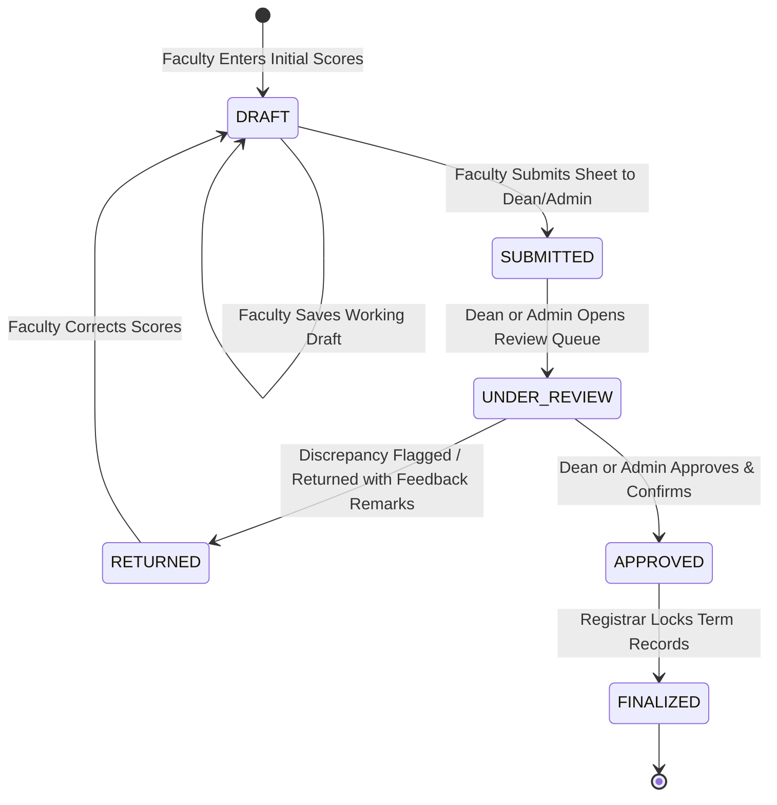
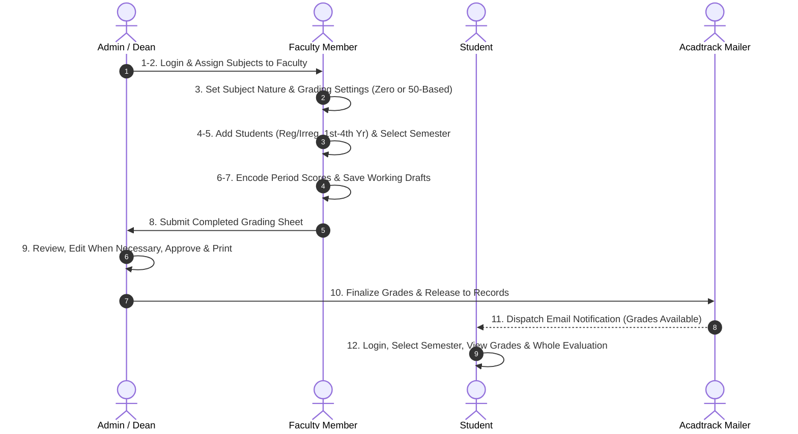

# Acadtrack — Feature Specifications & Workflow Architecture

> **Institution:** Golden West Colleges, Inc. (GWC)  
> **System:** Acadtrack — Academic Grading & Curriculum Evaluation Platform  
> **Reference Specification:** [grading_system_workflow.md](file:///C:/xampp/htdocs/acadtrack/grading_system_workflow.md)  
> **Related Documents:**
> * [Anti-Generic Design Standards](file:///C:/xampp/htdocs/acadtrack/docs/ANTI_GENERIC_DESIGN.md)
> * [Web Design & UI/UX Architecture](file:///C:/xampp/htdocs/acadtrack/docs/WEB_DESIGN_GUIDE.md)
> * [System Architecture & Error Handling](file:///C:/xampp/htdocs/acadtrack/docs/ARCHITECTURE.md)

---

## 1. System Overview

**Acadtrack** is a role-governed academic grading and curriculum evaluation platform engineered for Golden West Colleges, Inc. (GWC). It streamlines semester offerings, course assignments, student roster classification, period-based grade computation, multi-tier administrative reviews, automated email notifications, and student curriculum evaluations.

### Core Features (Official Specification)
As specified in `grading_system_workflow_text_based.pdf`, the system provides:

- **Role-Based Login** — Separate access and dashboards for Admin, Dean, Faculty/Instructor, and Student.
- **Semester Management** — Supports 1st Semester and 2nd Semester grading.
- **Faculty Subject Assignment** — Dean can assign subjects to specific Faculty/Instructor.
- **Subject Management** — Faculty can manage their assigned subjects and set the subject nature/type.
- **Student Management** — Faculty can add students and identify their status as Regular or Irregular and their Year Level from 1st–4th Year.
- **Grading Settings** — Faculty can choose Zero-Based or 50-Based grading and configure grading period weights.
- **Grade Encoding** — Faculty can enter and save grades for students.
- **Grade Submission** — Faculty can submit completed grading sheets for review and approval.
- **Grade Review and Approval** — Dean and Admin can view, edit, review, approve, and print submitted grading sheets.
- **Student Grade Viewing** — Students can select a semester and view their grades.
- **Whole Evaluation** — Students can view their complete grading evaluation and results.
- **Email Notifications** — Students receive email notifications for their account credentials (password) and when their grades/results are available.
- **Access Control** — Users can only access features and information appropriate to their role.

---

## 2. Role Permissions & Capability Matrix

| Feature / Capability | Admin | Dean | Faculty | Student | Route / Endpoint |
| :--- | :---: | :---: | :---: | :---: | :--- |
| **Role-Based Login & Dashboard Dispatch** | Yes | Yes | Yes | Yes | `/login`, `/dashboard` |
| **User Account & Password Administration** | Yes | No | No | No | `/admin/users` |
| **Semester & Term Management** (1st & 2nd Sem) | Yes | Yes | Yes | Yes | `/admin/settings`, `/faculty/grading` |
| **Faculty Subject Assignment** (Dean assigns to Faculty) | Yes | Yes | No | No | `/dean/faculty-assignments` |
| **Subject Management** (Nature & Type) | Yes | Yes | Yes | No | `/faculty/subjects` |
| **Student Management** (Regular/Irregular, 1st–4th Year) | Yes | Yes | Yes | No | `/faculty/students` |
| **Grading Settings** (Zero-Based / 50-Based, Weights) | No | No | Yes | No | `/faculty/grading/settings` |
| **Grade Encoding & Draft Autosaving** | No | No | Yes | No | `/faculty/grading` |
| **Grade Submission for Review** | No | No | Yes | No | `/faculty/grading/submit` |
| **Grade Review, Edit, Approval & Printing** | Yes | Yes | No | No | `/dean/grade-review`, `/dean/grading/print` |
| **Student Grade Viewing (1st & 2nd Semester)** | Yes | Yes | Yes | Yes | `/student/grades` |
| **Whole Evaluation & Results Viewing** | Yes | Yes | No | Yes | `/student/evaluation` |
| **Email Notifications** (Credentials & Grades) | System | System | System | Recipient | Background Mailer Service |
| **Access Control** (Role-Appropriate Isolation) | Yes | Yes | Yes | Yes | `AuthMiddleware`, `RoleMiddleware` |

---

## 3. Grading Sheet Lifecycle State Machine

### State Definitions & Security Guarantees
* **`DRAFT`:** Editable solely by the assigned faculty member. Scores are autosaved or updated via `POST /faculty/grading/save`.
* **`SUBMITTED`:** Inputs locked on the faculty portal. Available in Dean/Admin review queue.
* **`UNDER_REVIEW`:** Dean or Admin has opened the grading sheet and is inspecting historical grade spread, scores, and percentage calculations.
* **`RETURNED`:** Dean has requested corrections with mandatory feedback comments. Inputs unlock for the faculty member to revise.
* **`APPROVED`:** Grades are certified by Dean or Admin. Triggers email notification dispatch to enrolled students.
* **`FINALIZED`:** Term closed. Approved grades become immutable historical records in student academic files.

---

## 4. End-to-End Operational Workflow (The 12-Step Architecture)

### Step 1: Login & Role-Based Dispatching
* **Actor:** All Users (Admin, Dean, Faculty, Student)
* **Route:** `GET /login` &rarr; `POST /login`
* **Process:** User enters email address and password. The system authenticates bcrypt hash and dispatches user to their dedicated role dashboard:
  * Admin &rarr; `/admin/dashboard`
  * Dean &rarr; `/dean/dashboard`
  * Faculty &rarr; `/faculty/dashboard`
  * Student &rarr; `/student/dashboard`

### Step 2: Dean Assigns Subjects
* **Actor:** College Dean (or Admin)
* **Route:** `/dean/faculty-assignments`
* **Process:** Dean selects a Faculty/Instructor from the department roster and assigns specific curriculum subjects and section course loads they will handle for the academic year.

### Step 3: Faculty Sets Up Subject
* **Actor:** Faculty Member
* **Route:** `/faculty/subjects`, `/faculty/grading/settings`
* **Process:** Faculty selects an assigned subject and configures:
  * **Subject Nature / Type:** Lecture, Laboratory, or Combined.
  * **Grading Method:** **Zero-Based (0–100)** or **50-Based (50–100)**.
  * **Grading Period Weights:** Default Prelim (20%), Midterm (20%), Semi-Final (20%), Final (40%).

### Step 4: Faculty Adds/Selects Students
* **Actor:** Faculty Member
* **Route:** `/faculty/students`
* **Process:** Faculty encodes or selects students enrolled in the class section and records:
  * **Enrollment Status:** `Regular` or `Irregular`.
  * **Year Level:** `1st Year`, `2nd Year`, `3rd Year`, or `4th Year`.

### Step 5: Select Semester
* **Actor:** Faculty Member
* **Route:** `/faculty/grading`
* **Process:** Faculty selects the active semester context:
  * **1st Semester**
  * **2nd Semester**
  Loads corresponding student class roster and period assessment columns.

### Step 6: Faculty Enters Grades
* **Actor:** Faculty Member
* **Route:** `/faculty/grading?subject_id={id}&semester={sem}`
* **Process:** Faculty inputs student scores for Prelim, Midterm, Semi-Final, and Final periods according to the configured grading method and period weights.
* **Standards:** Inputs enforce `tabular-nums` alignment, real-time decimal precision, and zero layout shift.

### Step 7: Save and Review Drafts
* **Actor:** Faculty Member
* **Route:** `POST /faculty/grading/save`
* **Process:** Faculty repeatedly saves working drafts with zero lockouts. System automatically calculates grade point equivalents, status marks (`Passed`, `Failed`, `Incomplete`), and checks for data completeness before submission.

### Step 8: Submit Grading Sheet
* **Actor:** Faculty Member
* **Route:** `POST /faculty/grading/submit`
* **Process:** Once all scores are verified, faculty submits the completed grading sheet. A modal confirmation confirms finalization. Input fields immediately lock (`SUBMITTED`) to safeguard data integrity.

### Step 9: Dean/Admin Review
* **Actor:** College Dean and/or System Administrator
* **Route:** `/dean/grade-review`, `/dean/grading/print`
* **Process:** Dean and/or Admin reviews the submitted grades. They can:
  * **View:** Inspect grade distributions, averages, and student performance.
  * **Edit when necessary:** Adjust or correct individual marks when institutional policy requires correction.
  * **Approve:** Certify and approve the grading sheet.
  * **Confirm the grading sheet:** Finalize the sheet status and lock approved records.
  * **Print:** Generate and print official physical grade sheets for registrar filing.

### Step 10: Grade Finalization
* **Actor:** Administration / System
* **Process:** Once the grades are finalized/approved, the student's results become available according to the existing approval workflow. Final marks become official records in the student's academic transcript.

### Step 11: Email Notification
* **Actor:** System (Automated Mailer Service)
* **Process:** 
  1. Student receives an email notification informing them that their grades/results are available.
  2. Newly provisioned student accounts also receive an automated email notification with their account credentials (password).

### Step 12: Student Views Evaluation
* **Actor:** Student
* **Routes:** `/student/grades`, `/student/evaluation`
* **Process:**
  1. Student logs in.
  2. Selects **1st Semester** or **2nd Semester** to view period grades.
  3. Clicks **"View Whole Evaluation"** to view their complete grading evaluation, curriculum progress, and academic standing results.

---

## 5. Exception & Edge Case Protocols

1. **Duplicate Subject Assignment:** Intercepted at controller level; displays dismissible warning banner preventing duplicate instructor assignment to the same section.
2. **Incomplete Grade Submissions:** Unfilled score rows prompt validation alerts; instructors must resolve blanks or explicitly assign `INC` (Incomplete) status.
3. **Returned Grading Sheets:** Highlighted with contextual review banner on `/faculty/grading`, displaying Dean's exact feedback comments and restoring input editability.
4. **Email Dispatch Failures:** Logged to application error logs; grade publication succeeds independently so students can still view results via portal inquiry even if external mail server is unreachable.