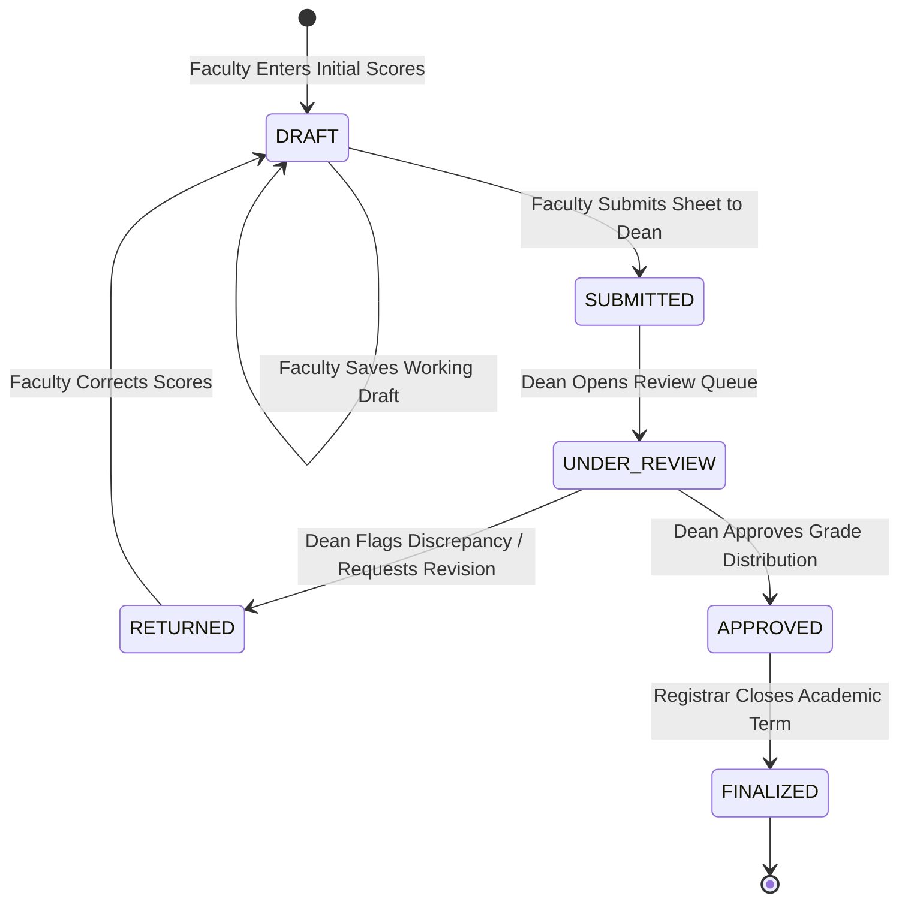
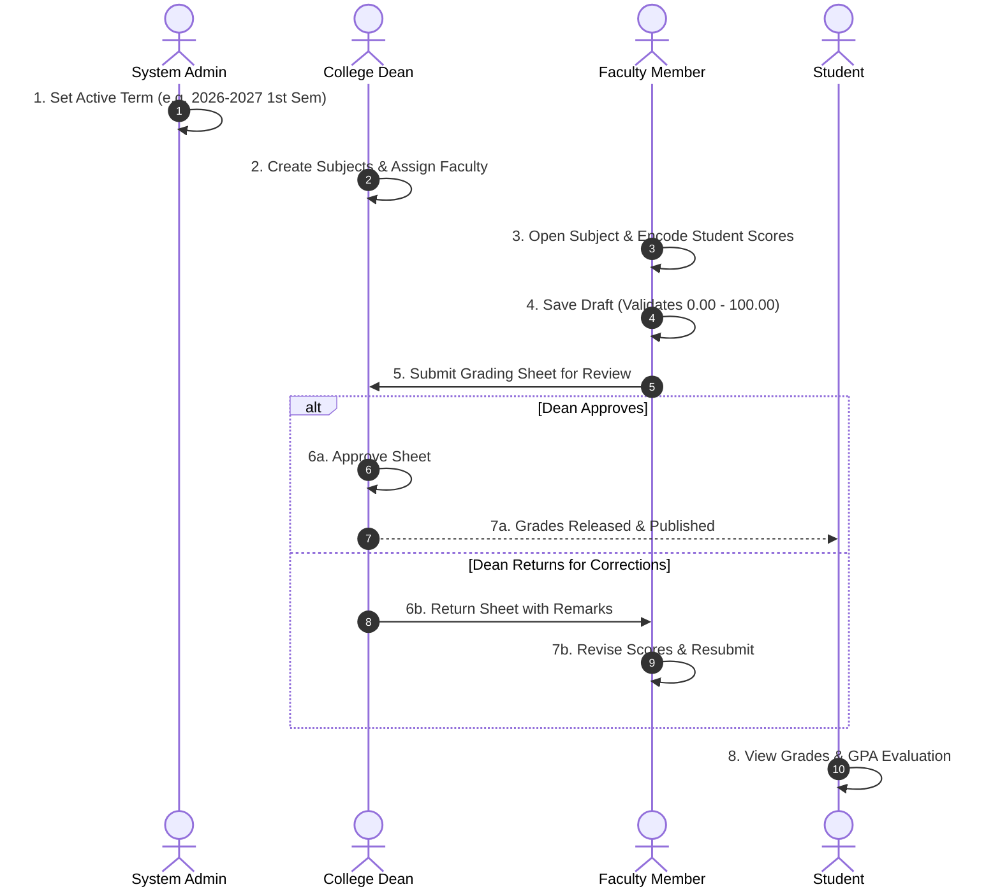

# GWC Grading System — Feature Specifications & Workflow Architecture

> **Institution:** Golden West Colleges, Inc. (GWC)  
> **System:** Academic Grading & Curriculum Evaluation Platform  
> **Related Documents:**
> * [Web Design & UI/UX Architecture](file:///C:/xampp/htdocs/grading-system/Web-Designing.md)
> * [Anti-Generic Design Standards](file:///C:/xampp/htdocs/grading-system/docs/ANTI_GENERIC_DESIGN.md)
> * [System Architecture & Error Handling](file:///C:/xampp/htdocs/grading-system/docs/ARCHITECTURE.md)

---

## 1. System Overview

The **GWC Grading System** is a role-governed academic management platform designed to streamline course assignments, student enrollments, grade computation, multi-tier reviews, and curriculum evaluations for Golden West Colleges, Inc. (GWC).

The platform serves four primary academic stakeholders:
1. **System Administrator:** Manages user accounts, active academic terms, grading scales, and system security.
2. **College Dean:** Oversees curriculum offerings, assigns faculty to courses, audits grade distributions, and approves or returns submitted grading sheets.
3. **Faculty / Instructor:** Enrolls class rosters, encodes student scores across academic periods, saves working drafts, and submits completed grading sheets.
4. **Student:** Views verified semester grades, tracks GPA, and reviews academic standing and evaluation remarks.

---

## 2. Role Permissions & Capability Matrix

| Feature / Capability | Admin | Dean | Faculty | Student | Route / Endpoint |
| :--- | :---: | :---: | :---: | :---: | :--- |
| **User Account Management** (Create, Edit, Deactivate) |  Yes |  No |  No |  No | `/admin/users` |
| **System Settings** (Grading Scale, Academic Term) |  Yes |  No |  No |  No | `/admin/settings` |
| **Create & Manage Subjects** |  Yes |  Yes |  No |  No | `/dean/subjects` |
| **Assign Subjects to Faculty** |  Yes |  Yes |  No |  No | `/dean/faculty-assignments` |
| **View Assigned Subjects & Class Lists** |  Yes |  Yes |  Yes |  No | `/faculty/subjects` |
| **Encode & Save Student Grades (Drafts)** |  No |  No |  Yes |  No | `/faculty/grading` |
| **Submit Grading Sheet for Dean Approval** |  No |  No |  Yes |  No | `/faculty/grading/submit` |
| **Review, Return & Approve Grading Sheets** |  Yes |  Yes |  No |  No | `/dean/grade-review` |
| **View Individual Semester Grades** |  Yes |  Yes |  Yes |  Yes | `/student/grades` |
| **View Comprehensive Curriculum Evaluation** |  Yes |  Yes |  No |  Yes | `/student/evaluation` |
| **Print Final Grade Sheets** |  Yes |  Yes |  Yes |  No | `/faculty/grading/print` |

---

## 3. Grading Sheet Lifecycle State Machine

### State Definitions & Security Guarantees
* **`DRAFT`:** Editable solely by the assigned faculty member. Scores are autosaved or updated via `POST /faculty/grading/save`.
* **`SUBMITTED`:** Inputs locked on the faculty portal. Available in Dean's `/dean/grade-review` queue.
* **`UNDER_REVIEW`:** Dean has opened the grading sheet and is inspecting historical grade spread and percentage calculations.
* **`RETURNED`:** Dean has requested corrections with mandatory feedback comments. Inputs unlock for the faculty member.
* **`APPROVED`:** Grades are certified by Dean. Visible to enrolled students on `/student/grades`.
* **`FINALIZED`:** Term locked by Registrar. Database row triggers prevent any further score mutations.

---

## 4. End-to-End Operational Workflow

### Step 1: Authentication & Role-Based Dispatching
* **Actor:** All Users
* **Route:** `GET /login` &rarr; `POST /login`
* **Process:** User provides email and password. System checks bcrypt password hash and initializes session with role assignment:
  * Admin &rarr; `/admin/dashboard`
  * Dean &rarr; `/dean/dashboard`
  * Faculty &rarr; `/faculty/dashboard`
  * Student &rarr; `/student/dashboard`

### Step 2: Academic Term Activation
* **Actor:** Admin
* **Route:** `/admin/settings`
* **Process:** Admin activates academic year (`2026-2027`) and term (`1st Semester`). All course assignments and grade computations bind to this active term ID.

### Step 3: Subject Creation & Faculty Assignment
* **Actor:** Dean (or Admin)
* **Routes:** `/dean/subjects`, `/dean/faculty-assignments`
* **Process:** Dean defines curriculum subjects with code, title, units, and year level. Dean assigns faculty members to course sections.
* **Constraint Protection:** Duplicate subject code for active term or duplicate faculty assignment triggers a graceful contextual alert banner.

### Step 4: Grading Scale & Baseline Configuration
* **Actor:** Admin
* **Process:** System supports **Zero-Based (0–100)** or **Fifty-Based (50–100)** baselines. Standard period weights:
  * **Prelim:** 20%
  * **Midterm:** 20%
  * **Semi-Final:** 20%
  * **Final:** 40%

### Step 5: Student Enrollment & Roster Management
* **Actor:** Admin / Registrar
* **Route:** `/admin/users`
* **Process:** Enrolls regular and irregular students into course sections with their unique Student Number (e.g., `2026-0001`).

### Step 6: Grade Encoding by Faculty
* **Actor:** Faculty
* **Route:** `/faculty/grading?subject_id={id}`
* **Process:** Faculty selects an assigned subject and enters scores for Prelim, Midterm, Semi-Final, and Final periods.
* **UI Standard:** Inputs utilize `.tabular-nums` and `.table-academic` with sticky column headers.

### Step 7: Draft Saving & Data Integrity
* **Actor:** Faculty
* **Route:** `POST /faculty/grading/save`
* **Process:** Faculty clicks **"Save Draft"**. Executes an upsert (`ON DUPLICATE KEY UPDATE`) into `grades` table. Status remains `DRAFT`.

### Step 8: Submission to Dean for Review
* **Actor:** Faculty
* **Route:** `POST /faculty/grading/submit`
* **Process:** When all student marks are verified, faculty clicks **"Submit for Review"**. Confirmation modal prompts for final review.
* **Result:** Sheet status transitions to `SUBMITTED`. Grade input fields lock to prevent modifications during review.

### Step 9: Dean Review, Revision & Approval
* **Actor:** Dean
* **Route:** `/dean/grade-review`
* **Process:**
  * **Approve:** Dean certifies grade distribution. Status changes to `APPROVED`.
  * **Return:** Dean enters mandatory feedback remarks (e.g., *"Re-check final exam scores for irregular students"*). Status transitions to `RETURNED`. The faculty portal displays an alert banner with the Dean's feedback, unlocking input fields for correction.

### Step 10: Term Finalization
* **Actor:** Registrar / System
* **Process:** Once all grading periods are approved, final term GPAs are computed and locked.

### Step 11: Automated Notifications
* **Actor:** System
* **Process:** Contextual alerts notify faculty when sheets are returned or approved, and students when final term grades are published.

### Step 12: Student Grade Inquiries & Evaluation
* **Actor:** Student
* **Routes:** `/student/grades`, `/student/evaluation`
* **Process:** Students review their grade records and overall curriculum evaluation:
  * **90% – 100%:** `Excellent` (*Outstanding performance*)
  * **80% – 89%:** `Very Good` (*Commendable performance*)
  * **70% – 79%:** `Good` (*Good performance*)
  * **60% – 69%:** `Satisfactory` (*Acceptable performance*)
  * **50% – 59%:** `Needs Improvement` (*Below expectations*)
  * **Below 50%:** `Failing` (*Unsatisfactory performance*)

---

## 5. Exception & Edge Case Protocols

1. **Duplicate Subject / Assignment Entries:** Intercepted at controller level; displays dismissible warning banner without fatal database exceptions.
2. **Incomplete Grade Submissions:** Blank rows must be resolved or explicitly marked as Incomplete (`INC`) prior to Dean submission.
3. **Returned Grading Sheets:** Highlighted with crimson alert banner on `/faculty/grading`, displaying Dean's exact review remarks.